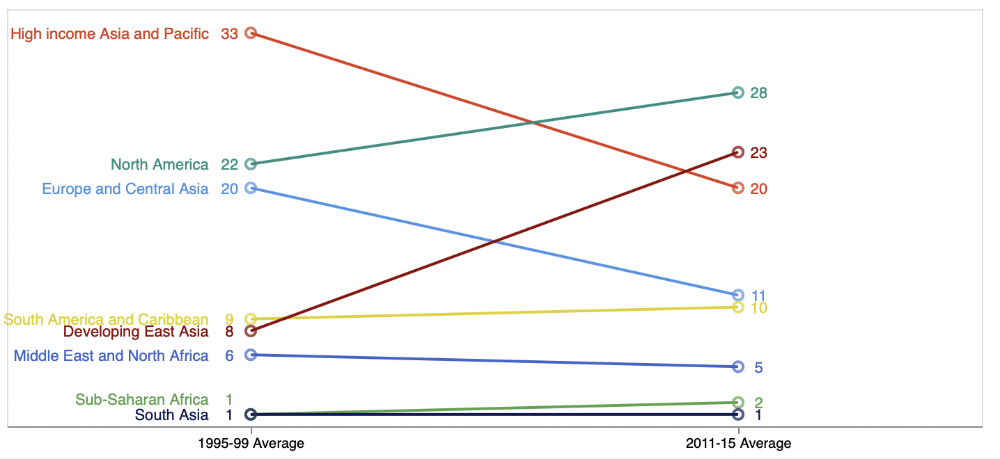

# Part 2 - Using Vega-lite

**Article:** [Remake: Pie-in-a-Donut Chart](https://policyviz.com/2018/02/15/remake-pie-in-a-donut-chart/)

**Original chart:** [Line chart #1](https://policyviz.com/wp-content/uploads/2018/02/PolicyViz_USDARemake_SlopeChart-600x362.png)

**Recreated chart:** 

**Observable Notebook:** [Part 2](https://observablehq.com/d/bcd5a8877830c8b3)

## **Process of recreating the chart:**

First downloaded the excel file from github and created a new excel sheet only with the data provided. For the recreation of this chart, only three attributes used, namely, Region, Year, and Value. The Average year’s column is into one column called “Year” as it is the same Ordered attribute. Then uploaded this excel file as .csv file to a observable notebook.

All three attributes are used inside the markLine function to plot lines. Hollow circles at the end of the line are plot using the markPoint function on the same attributes. Since, the text is written only on the left side of the line in the original chart, the dataset is filtered. Then markText function is used to plot the values and value attributes. dx and dy are used for adjusting the values.

Another variable is used to plot Sub-Saharan Africa. Again dx and dy are adjusted with respect to the original chart. Changed the size of the mark points based on the original chart.

The labels on X-axis for Year are displayed vertically by default. To make them horizontal, 0 value is assigned to the labelAngle parameter under axis function. The scale function is used to assign colors to the whole chart.

### Code: 
`
import {vl} from "@vega/vega-lite-api"
`

`
import {fromColumns, printTable} from "@uwdata/data-utilities"
`

`
slopechart = FileAttachment("Slope chart 2.csv").csv()
`

`
printTable(slopechart.slice(0, 10))
`

`
s1995 = slopechart.filter(d => d.Year === '1995-99 Average').filter(r => r.Region !== 'Sub-Saharan Africa')
`

`
s2011 = slopechart.filter(d => d.Year === '2011-15 Average')
`

`
s1995_sub_saharan_africa = slopechart.filter(d => d.Year === '1995-99 Average').filter(r => r.Region === 'Sub-Saharan Africa')
`

Please open observable notebook to see the rest of the code.

### References:

1. [Marks](https://observablehq.com/@observablehq/plot-marks)
2. [Filtering](https://observablehq.com/@uwdata/data-types-graphical-marks-and-visual-encoding-channels)
3. [Color](https://vega.github.io/vega-lite/docs/scale.html)
4. [Axis](https://observablehq.com/@alainro/dual-axis-charts)

