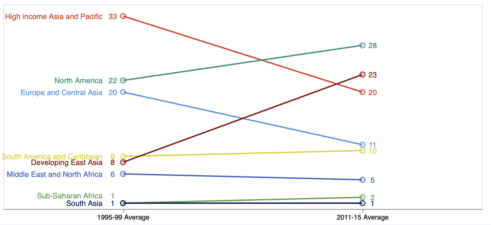

CS625-HW3: Re-create Charts
================
Priyanka Vepuri
10/05/2021

# Part 2 - Using Vega-lite

**Article:** [Remake: Pie-in-a-Donut
Chart](https://policyviz.com/2018/02/15/remake-pie-in-a-donut-chart/)

**Original chart:** [Line chart
\#1](https://policyviz.com/wp-content/uploads/2018/02/PolicyViz_USDARemake_SlopeChart-600x362.png)

**Recreated chart:** 

**Observable Notebook:** [Part
2](https://observablehq.com/d/bcd5a8877830c8b3)

## **Process of recreating the chart:**

First downloaded the excel file from github and created a new excel
sheet only with the data provided. For the recreation of this chart,
only three attributes used, namely, Region, Year, and Value. The Average
year’s column is into one column called “Year” as it is the same Ordered
attribute. Then uploaded this excel file as .csv file to a observable
notebook.

All three attributes are used inside the markLine function to plot
lines. Hollow circles at the end of the line are plot using the
markPoint function on the same attributes. Since, the text is written
only on the left side of the line in the original chart, the dataset is
filtered. Then markText function is used to plot the values and value
attributes. dx and dy are used for adjusting the values.

Another variable is used to plot Sub-Saharan Africa. Again dx and dy are
adjusted with respect to the original chart. Changed the size of the
mark points based on the original chart.

The labels on X-axis for Year are displayed vertically by default. To
make them horizontal, 0 value is assigned to the labelAngle parameter
under axis function. The scale function is used to assign colors to the
whole chart.

### Code:

`import {vl} from "@vega/vega-lite-api"`

`import {fromColumns, printTable} from "@uwdata/data-utilities"`

`slopechart = FileAttachment("Slope chart 2.csv").csv()`

`printTable(slopechart.slice(0, 10))`

`s1995 = slopechart.filter(d => d.Year === '1995-99 Average').filter(r => r.Region !== 'Sub-Saharan Africa')`

`s2011 = slopechart.filter(d => d.Year === '2011-15 Average')`

`s1995_sub_saharan_africa = slopechart.filter(d => d.Year === '1995-99 Average').filter(r => r.Region === 'Sub-Saharan Africa')`

Please open observable notebook to see the rest of the code.

### References:

1.  [Marks](https://observablehq.com/@observablehq/plot-marks)
2.  [Filtering](https://observablehq.com/@uwdata/data-types-graphical-marks-and-visual-encoding-channels)
3.  [Color](https://vega.github.io/vega-lite/docs/scale.html)
4.  [Axis](https://observablehq.com/@alainro/dual-axis-charts)
