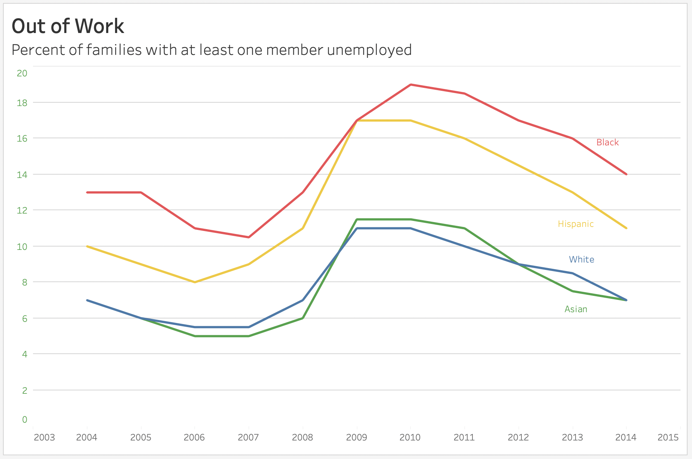
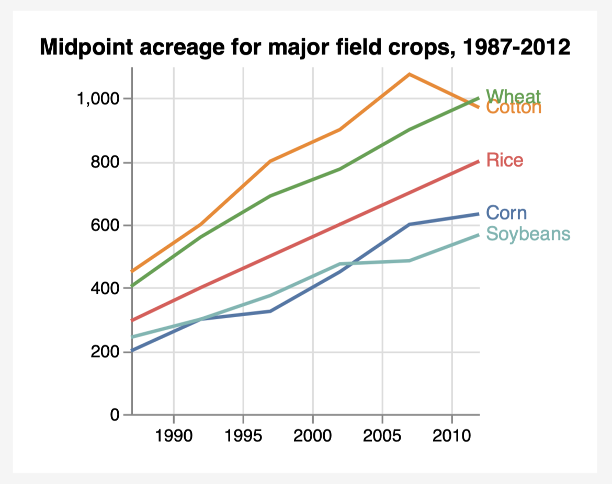

#### CS625 Homework 3: Re-create Charts

#### Name: Priyanka Vepuri

#### Date: 10/05/2021

# Part 1 - Using Tableau 

**Article:** [Remake: Paired Column Chart from WSJ](https://policyviz.com/2018/03/01/remake-paired-column-chart-from-wsj/)

**Data for the recreation of the chart:** [excel](chart 1 data.xlsx)

**Original chart:** [Line chart #1](https://policyviz.com/wp-content/uploads/2018/02/PolicyViz_WSJ_Remake_LineChart-1024x613.png)

**Recreated chart:** 

## **Process of recreating the chart:**

First downloaded the excel file from github and created a new excel sheet only with the data provided. Open *tableau* -> *Data* -> *New Data Source* -> *Files* -> *Upload from computer* -> selected the required file *chart 1 data.xlsx*.

Drag the *Year* and place in the *columns* section. And place the *Black*, *Hispanic*, *White*, *Asian* in *Rows* section. Then drag and drop the *Measure Values* in both *Color* and *Label* under the marks card.

Then under *Marks*, choose *All* -> click on dropdown box beside Automatic and select *Line*. Now under Marks, click on *SUM(Black)* -> *Color* -> *Edit color* -> select the required color by clicking on the name and color simultaneously. Now all the lines are changed to their required color.

Now, empty the rows section and add only *Measure Values* in the *rows* section.
Drag *Measure Names* to the *Filter* section and remove *Count of sheet1* -> click ok.

Go to *Format* -> Click on *Grid lines* and enable the *row grid lines* to remove the column lines from the background.

To add the title to the sheet, Click on the dropdown beside sheet -> *edit title* -> choose the font size -> and add the required title.

To change the color of the each label, Under *Marks* -> *label* -> *Font* -> *Match Mark Color*.

Finally, to remove the names on x-axis and y-axis, click on the *dropdown box on the axis* -> *edit axis* -> under title leave the space empty.

# Part 2 - Using Vega-lite

**Article:** [Remake: Time Series Column Chart](https://policyviz.com/2018/06/07/remake-time-series-column-chart/)

**Data for the recreation of the chart:** [excel](chart 2 data.xlsx)

**Original chart:** [Line chart #1](https://policyviz.com/wp-content/uploads/2018/06/PolicyViz_USDA_Remake_Line_Chart.png)

**Recreated chart:** 

## **Process of recreating the chart:**

First downloaded the excel file from github and created a new excel sheet only with the data provided. Open vega-lite, add title and subtitle to the chart by using the command *"title": "Midpoint acreage for major field crops, 1987-2012",*.

Now by using the data in the excel file, enter the values in the vega-lite. Then use *markline* to plot the lines in the chart. Enter the color, field, type and legend to the code which is to be plotted on the chart.

Give the x and y axis description in the code as required and leave the title field empty as the axis labels are not shown in the original chart.

### References

1. [Vega-lite](https://vega.github.io/vega-lite/docs/line.html#multi-series-colored-line-chart)

2. [Vega-Multiple line charts](https://vega.github.io/vega-lite/examples/line_color.html)

3. [Vega-Line chart with point markers](https://vega.github.io/vega-lite/examples/line_overlay.html)

